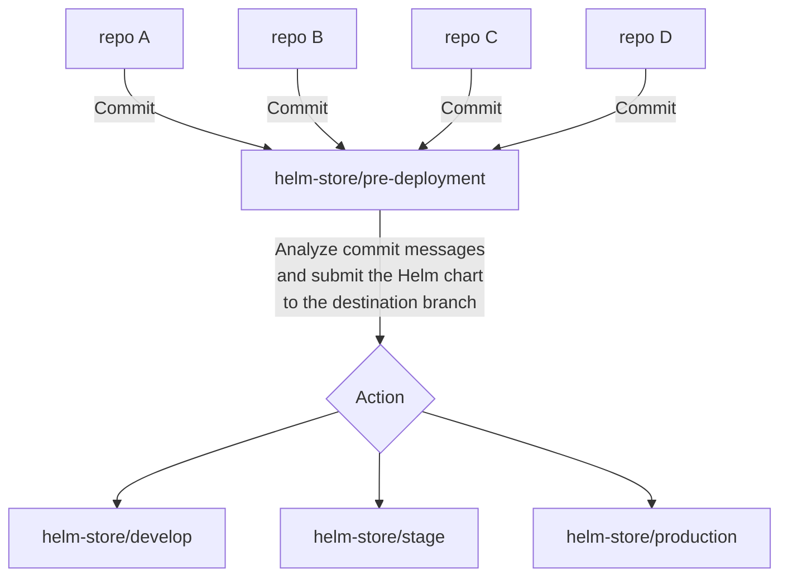

# helm-store
This repository was created with the purpose of serving as an illustrative example for my Medium article, "Building Your GitOps Pipeline with GitHub, Actions, DockerHub, and Helm Repository". Its primary role is to serve as a catalog of Helm charts.

The operational architecture is as follows:

Repository containing my posts on [MEDIUM](https://medium.com/@eduardo854).

To be notified every time a new post is published, **SUBSCRIBE [HERE](https://medium.com/@eduardo854/subscribe)**.
